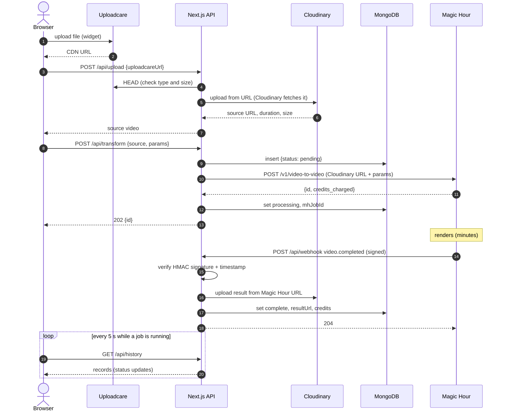

# Video to Video

Restyle short videos with AI. Upload a clip, pick one of Magic Hour's 75 art styles, and get a transformed video back a few minutes later. Every job is kept in a per-browser history with its parameters, source and result.

**Live:** https://video2video-case-study.vercel.app

Built with Next.js 16 (App Router) · TypeScript · Ant Design 6 · MongoDB · Uploadcare · Cloudinary · Magic Hour API · Vercel.

---

## Contents

1. [How it works](#how-it-works)
2. [Run locally](#run-locally)
3. [Environment variables](#environment-variables)
4. [Webhook and async processing](#webhook-and-async-processing)
5. [API reference](#api-reference)
6. [Error handling](#error-handling)
7. [Security](#security)
8. [Deploying to Vercel](#deploying-to-vercel)
9. [Project structure](#project-structure)
10. [Design decisions and limits](#design-decisions-and-limits)

---

## How it works

| Service | Role |
|---|---|
| **Uploadcare** | Browser upload widget. The file goes straight from the browser to Uploadcare's CDN, so large videos never pass through our API (Vercel caps request bodies at 4.5 MB). |
| **Cloudinary** | Permanent storage for source and result videos. Also serves optimized playback (`q_auto`), downloads (`fl_attachment`) and poster frames (`so_0` → `.jpg`). |
| **Magic Hour** | The video-to-video model. Reads the source from Cloudinary and reports the result to our webhook. |
| **MongoDB** | One `transformations` collection: status, parameters, URLs, Magic Hour job id, credits, errors. |
| **Vercel** | Hosts the app and API routes, and provides the public HTTPS URL the webhook needs. |

The user flow is three steps: **Upload → Configure → Processing**. History lives on its own page.

---

## Run locally

**Requirements:** Node.js 20.9+ and free accounts on Uploadcare, Cloudinary, MongoDB Atlas and Magic Hour (see [Environment variables](#environment-variables)).

```bash
git clone https://github.com/MtyldZ/video2video-case-study.git && cd video2video-case-study
npm install
cp .env.example .env.local        # then fill in the keys
npm run check:services            # verifies MongoDB, Cloudinary and Magic Hour credentials (uses no credits)
npm run dev                       # http://localhost:3000
```

**No webhook needed locally.** Magic Hour can't reach `localhost`, so the app falls back to polling Magic Hour while the Processing step or History page is open. Results show up about 2–3 minutes after a render finishes. See [Fallback polling](#fallback-polling). If you want real webhooks locally, run a tunnel (for example `cloudflared tunnel --url http://localhost:3000`) and register `https://<tunnel>/api/webhook` in Magic Hour.

### Scripts

| Command | What it does |
|---|---|
| `npm run dev` / `build` / `start` | Next.js dev server, production build, production server |
| `npm run lint` | ESLint |
| `npm run check:logic` | Assertion checks for input validation, the 5 s clip cap and webhook signature verification. Needs no keys. |
| `npm run check:services` | Connects to MongoDB, Cloudinary and Magic Hour with your `.env.local`. Free. |
| `npm run webhook:replay -- <mhJobId> [completed\|errored] [url]` | Sends a correctly signed Magic Hour-style event to your local app, for testing the webhook without a tunnel |

---

## Environment variables

Copy `.env.example` to `.env.local`. All variables are server-only except `NEXT_PUBLIC_UPLOADCARE_PUBLIC_KEY`. They are validated with zod on first use, so a missing key fails with a clear message instead of an obscure crash.

| Variable | Required | Where to get it |
|---|---|---|
| `NEXT_PUBLIC_UPLOADCARE_PUBLIC_KEY` | yes | Uploadcare dashboard → your project → **API keys** → Public key |
| `CLOUDINARY_CLOUD_NAME` | yes | Cloudinary console → **Settings → API Keys** |
| `CLOUDINARY_API_KEY` | yes | same page |
| `CLOUDINARY_API_SECRET` | yes | same page |
| `MONGODB_URI` | yes | Atlas → **Clusters → Connect → Drivers**. See the MongoDB steps below. |
| `MONGODB_DB` | no (default `video2video`) | Any database name; created automatically |
| `MAGIC_HOUR_API_KEY` | yes | Magic Hour → **Developer Hub → API Keys → Create new API Key** |
| `MAGIC_HOUR_WEBHOOK_SECRET` | for webhooks | Magic Hour → **Developer Hub → Webhooks**, shown when you create the webhook. See [Registering the webhook](#registering-the-webhook). Without it, `/api/webhook` rejects every request. |
| `APP_URL` | on Vercel | The public URL of the app. Used to build absolute URLs for social share images. |

### MongoDB Atlas setup

1. Create a free cluster.
2. **Database Access → Add New Database User**: password authentication, role **Read and write to any database**. Autogenerate the password so it needs no URL-encoding. Don't use Service Accounts; those are for the Atlas admin API.
3. **Network Access → Add IP Address → Allow access from anywhere (`0.0.0.0/0`)**. Vercel's servers use changing IP addresses.
4. **Clusters → Connect → Drivers**: copy the URI and replace `<db_password>` with the password.

Indexes are created automatically on first connection.

### Magic Hour credits

The free tier starts with 500 credits. A video-to-video render cost about **30 credits per second of clip at HALF frame rate** and roughly twice that at FULL. To protect the budget, **clips are capped at 5 seconds**, enforced in both the form and the API.

**Known quirk:** for some styles (e.g. Studio Ghibli), style version `default` resolves to a V3 model that the API doesn't serve yet, and Magic Hour rejects the job without charging. The app explains this and asks the user to pick `v1` or `v2`.

---

## Webhook and async processing

A render takes minutes, so the request that starts it can't wait for the result. The app records the job, hands it to Magic Hour, and finishes the record later, when Magic Hour calls back.



### Step by step

1. **Upload.** The Uploadcare widget uploads the file directly from the browser. `POST /api/upload` accepts only HTTPS Uploadcare CDN URLs, re-checks format (MP4 or MOV) and size (≤ 100 MB) with a `HEAD` request, then asks Cloudinary to fetch the file by URL. The video never streams through our function.
2. **Submit.** `POST /api/transform` validates the parameters, confirms the source URL belongs to *our* Cloudinary account, and **inserts the record before calling Magic Hour**. That way a paid job can never exist without a record. Magic Hour returns a job id, which is saved as `mhJobId` along with the estimated credits, and the record becomes `processing`.
3. **Callback.** Magic Hour sends `video.completed` or `video.errored` to `/api/webhook`. Webhooks are registered in the Magic Hour dashboard rather than per request, and the payload carries only Magic Hour's job id, so we match on the saved `mhJobId`.
4. **Finish.** On `completed`, the result is copied from Magic Hour's temporary download URL into Cloudinary under `video2video/results/<mhJobId>`, and the record becomes `complete` with the permanent URL and final credits. On `errored` or `canceled`, it becomes `failed` with Magic Hour's error message.
5. **Display.** The Processing step and History page poll `GET /api/history` every 5 s, only while a job is `pending` or `processing`.

### Reliability details

| Concern | How it's handled |
|---|---|
| Retries | Magic Hour retries any non-2xx response for up to 24 h with backoff. We return **404** for an unknown job and **500** for a processing failure (Cloudinary or MongoDB down), so these are retried automatically. |
| Race: webhook arrives before `mhJobId` is saved | The lookup returns 404, and Magic Hour retries a moment later. |
| Duplicate deliveries | Idempotent. Records already `complete` or `failed` are left alone. The result upload uses a fixed Cloudinary public id (the job id), so a repeat overwrites instead of duplicating. Updates are conditional on the record not being final. |
| Magic Hour's download URLs expire | The result is copied to Cloudinary as soon as it arrives. |

### Fallback polling

Webhooks can be missed: the tunnel is down, the dashboard isn't configured, or the app is running on `localhost`. So every `GET /api/history` also checks stale jobs (`src/lib/jobs.ts`):

- A job still unfinished **2 minutes** after submission is looked up with `GET /v1/video-projects/{id}` and run through the same code as the webhook.
- Each job is polled **at most once a minute**. An atomic "claim" on a `checkedAt` field stops concurrent tabs from polling the same job twice.
- After **20 minutes** with no result, the job becomes `timed_out`. That status is *not* final: polling continues (throttled) for 24 h, so a late result still becomes `complete`. The UI offers **Check again**, or **Retry** (a new job, new credits, with a confirmation).
- A record that was saved but never reached Magic Hour (a crash between the two steps) becomes `failed`.

### Status lifecycle

```
pending ──submit ok──▶ processing ──webhook/poll──▶ complete
   │                       │  └──────────────────▶ failed   (errored / canceled)
   │                       └──20 min, no result──▶ timed_out ──late result──▶ complete
   └──submit failed / never submitted──────────▶ failed
```

---

## API reference

`upload`, `transform` and `history` return JSON, with errors as `{ "error": "<user-facing message>" }`. The webhook, called only by Magic Hour, replies with a status code and plain text.

### `POST /api/upload`
Copies a video already uploaded to Uploadcare into Cloudinary.

```json
// request
{ "uploadcareUrl": "https://<prefix>.ucarecd.net/<uuid>/" }
// 200
{ "url": "https://res.cloudinary.com/…/video2video/sources/<id>.mp4", "publicId": "video2video/sources/<id>",
  "duration": 13.4, "width": 854, "height": 480, "bytes": 9094354 }
```
Errors: `400` invalid or non-Uploadcare URL, or unreachable file · `413` over 100 MB · `415` not MP4/MOV · `502` Cloudinary failure.

### `POST /api/transform`
Starts a Magic Hour job. `params` mirrors Magic Hour's request body, so every model option is supported.

```json
// request
{
  "source": { "url": "https://res.cloudinary.com/<cloud>/video/upload/…", "publicId": "video2video/sources/<id>" },
  "params": {
    "name": "Skate park",                       // optional
    "start_seconds": 0, "end_seconds": 3,       // end > start, length ≤ 5 s
    "fps_resolution": "HALF",                   // HALF | FULL
    "style": {
      "art_style": "Pixar",                     // one of 75 styles
      "model": "default",                       // default | Dreamshaper | Absolute Reality | Flat 2D Anime | Soft Anime | Kaywaii | Western Anime | 3D Anime
      "version": "default",                     // default | v1 | v2
      "prompt_type": "default",                 // default | custom | append_default
      "prompt": "…"                             // required unless prompt_type is default
    }
  }
}
// 202
{ "id": "<record id>", "status": "processing" }
```
Errors: `400` invalid parameters, a source from another Cloudinary account, or Magic Hour rejected the parameters · `402` not enough Magic Hour credits · `429` rate limited · `500` Magic Hour key misconfigured · `502` Magic Hour unavailable · `503` database unavailable.

### `POST /api/webhook`
Magic Hour's callback. Requires the `magic-hour-event-signature` and `magic-hour-event-timestamp` headers.
Responses: `204` handled or ignored · `401` bad signature or stale timestamp · `400` malformed body · `404` unknown job (retried) · `500` processing failed or secret not configured (retried).

### `GET /api/history`
The current browser's 50 most recent transformations, newest first. Also runs the [fallback polling](#fallback-polling).

```json
{ "items": [ { "_id": "…", "status": "complete", "sourceUrl": "…", "resultUrl": "…", "params": { … },
               "mhJobId": "…", "creditsCharged": 30, "error": null, "createdAt": "…", "updatedAt": "…" } ] }
```
Errors: `503` database unavailable.

---

## Error handling

| Where | Case | What the user sees |
|---|---|---|
| Upload | Wrong format, too large | Blocked by the widget; re-checked on the server (415 / 413) |
| Upload | Invalid, foreign or unreachable URL | "Invalid video URL…" / "Video URL is not reachable." |
| Upload | Cloudinary failure, network error | Error alert; remove the file and retry |
| Configure | Missing style, missing prompt, clip > 5 s | Inline field errors; the slider can't exceed 5 s |
| Submit | No credits, bad parameters, rate limit, service down | Alert with a specific message (402 / 400 / 429 / 502) |
| Processing | Render failed or canceled | Error result with Magic Hour's message, **Retry** and **Change settings** |
| Processing | No result after 20 min | Warning result with **Check again** and **Retry** |
| History | Load failure, empty | Error state with **Try again** / empty state with a call to action |
| App | Offline, unknown route, render crash | Offline banner, 404 page, error boundary with **Try again** |

---

## Security

- **Webhook signature verification.** HMAC-SHA256 over `{timestamp}.{raw body}` with the webhook secret, compared with `timingSafeEqual`. Timestamps more than 5 minutes off are rejected, which stops replayed requests. The raw body is verified before parsing. With no secret configured, the endpoint rejects everything.
- **Input validation.** Every request body is validated with zod, the same schemas the form uses. The upload endpoint accepts only HTTPS Uploadcare CDN URLs (checked against a hostname allowlist, which prevents it being used to fetch arbitrary URLs), and the transform endpoint accepts only sources in our own Cloudinary account.
- **Secrets** are server-only. Only the Uploadcare public key is exposed to the browser. Magic Hour key errors are logged but shown to users only as "misconfigured".
- **History scoping.** An anonymous `httpOnly`, `SameSite=Lax` (and `Secure` in production) `uid` cookie scopes each browser's history. There's no login by design; the brief doesn't require one. Adding login would only change where `uid` comes from (`src/lib/uid.ts`).
- **HTTPS everywhere.** Vercel, Cloudinary, Uploadcare and Magic Hour are all HTTPS.

---

## Deploying to Vercel

1. Push the repo to GitHub and **import** it in Vercel. The framework is detected automatically.
2. Add every variable from `.env.example` under **Settings → Environment Variables**, with `APP_URL` set to the production URL (e.g. `https://<project>.vercel.app`).
3. Deploy.
4. [Register the webhook](#registering-the-webhook), put its secret in `MAGIC_HOUR_WEBHOOK_SECRET`, and **redeploy** so the new variable takes effect.

### Registering the webhook

In Magic Hour → **Developer Hub → Webhooks → Create Webhook**:

- **Endpoint URL:** `https://<your-app>.vercel.app/api/webhook`
- **Events:** `video.completed` and `video.errored` only
- Copy the **secret** into `MAGIC_HOUR_WEBHOOK_SECRET`.

Route timeouts: `/api/upload`, `/api/webhook` and `/api/history` set `maxDuration = 60` because they may wait on Cloudinary copying a video.

---

## Project structure

```
src/
  app/
    page.tsx                 Create flow (Upload → Configure → Processing)
    history/page.tsx         History page
    api/upload/route.ts      Uploadcare → Cloudinary
    api/transform/route.ts   Create record, submit to Magic Hour
    api/webhook/route.ts     Verify signature, apply result
    api/history/route.ts     List records + fallback polling
    layout.tsx, providers.tsx, error.tsx, not-found.tsx, icons and share images
  components/
    AppShell.tsx             Header / nav / footer / offline banner
    VideoUpload.tsx          Uploadcare inline widget + /api/upload
    TransformForm.tsx        All Magic Hour options, 5 s cap, render summary
    JobStatus.tsx            Processing, complete, failed and timed-out states
    HistoryList.tsx          History cards + detail drawer
    JobParts.tsx             Status tag, video player, parameter summary
  lib/
    schemas.ts               zod schemas and types shared by client and server
    jobs.ts                  Apply a Magic Hour result (webhook + polling), stale-job polling
    magichour.ts             Magic Hour client + webhook signature check
    cloudinary.ts, db.ts, env.ts, uid.ts
    api.ts, media.ts, theme.ts   Client fetch helpers, Cloudinary URL helpers, antd theme
scripts/                     check-logic, check-services, replay-webhook
```

---

## Design decisions and limits

- **UI** built with Ant Design 6 only, themed with tokens from a design handoff. Light and dark follow the OS; controls are at least 44 px tall on phones.
- **Uploadcare's inline widget** handles picking files, links, progress and retries, instead of a custom drop zone.
- **No progress percentage.** Magic Hour reports only queued, rendering and final states, so the UI shows status, not a fake percentage.
- **Anonymous history.** It's per browser, so a different browser or a private window has its own history.
- **History shows the newest 50 items.** Paging (an `_id < before` cursor) is a small addition if needed.
- **No background worker.** Fallback polling runs only when someone views History or the Processing step. Webhooks cover the rest in production.
- **The 5 s clip cap** exists to protect the free credit budget. It's one constant (`MAX_CLIP_SECONDS` in `src/lib/schemas.ts`).
